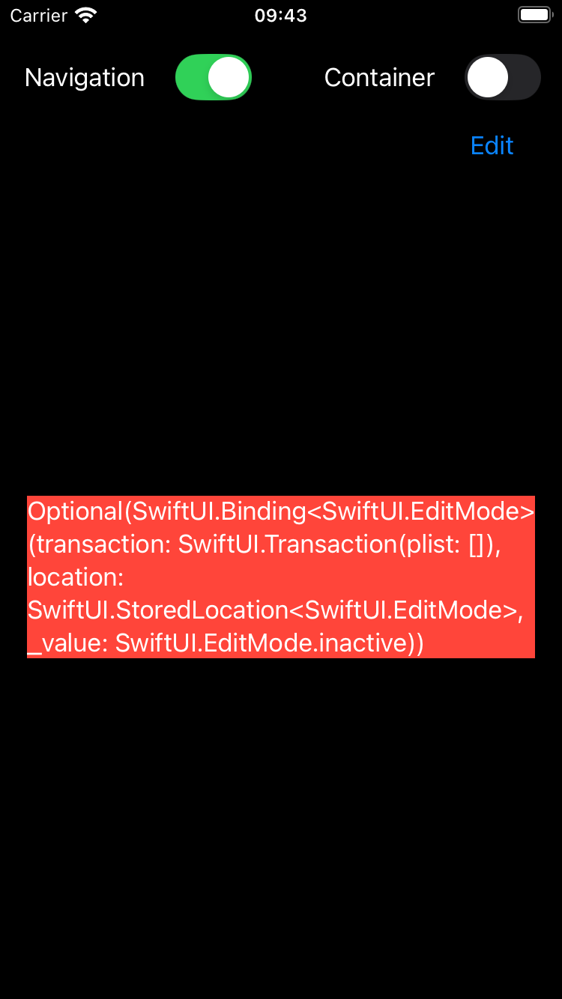

# editMode doesn't get updated

Why isn't the EditMode updated in a Navigation Stack without a `H/V/ZStack` around it?

Might be related to this thread from [Nov' 23](https://developer.apple.com/forums/thread/742383)

